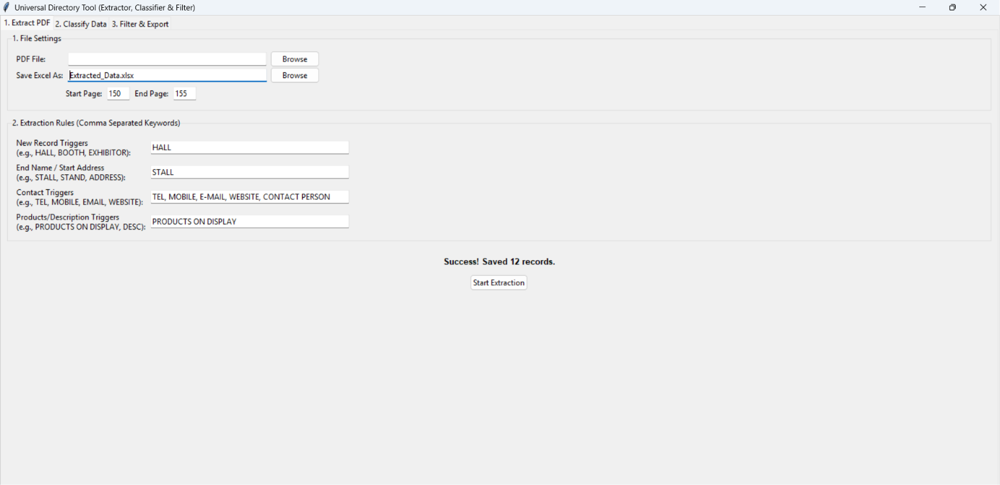

# 📊 Universal Business Data Extraction & Classification Suite


<p align="center">
  <b>An all-in-one desktop application that automates business directory processing, company classification, and intelligent Excel filtering.</b>
</p>

---

# 🚀 Overview

Universal Business Data Extraction Suite is a desktop application developed to automate repetitive business data processing tasks.

Instead of spending hours manually extracting company information, searching websites, classifying businesses, and filtering Excel sheets, the application performs these tasks through three integrated automation tools.

Designed for real-world office environments, the software focuses on reducing manual work while maintaining a simple interface for non-technical users.

---

# ✨ Features

## 📄 1. OCR Data Extraction

Extract structured information directly from scanned PDFs and images.

### Features

- OCR using Tesseract
- Supports scanned directories
- Automatic text parsing
- Structured data extraction
- Export directly to Excel

---

## 🌐 2. Company Classification Assistant

Automatically classify companies using Google Search.

### Workflow

1. Upload an Excel file containing company names.
2. The application automatically searches each company on Google.
3. A popup window displays classification buttons.
4. Select the appropriate category.

Example buttons:

- 🍴 Cutlery
- 📦 Packaging
- ❌ None
- ⏭ Skip

The application automatically saves the selected category into a new Excel spreadsheet.

This significantly reduces the time required to manually classify hundreds of companies.

---

## 🔍 3. Intelligent Excel Filter

Quickly create filtered Excel files based on company categories.

### Example

Suppose your master spreadsheet contains:

| Company | Category |
|----------|-----------|
| ABC Ltd | Packaging |
| XYZ Pvt Ltd | Cutlery |
| Bright Industries | Packaging |

Simply type:

```
Packaging
```

The application automatically creates a new Excel file containing only packaging companies.

This works with any keyword or business category present in the dataset.

---

# 📸 Screenshots

## Main Dashboard



---

## OCR Extraction

![OCR]
)


---

## Company Classification Popup

![Classification]


---

## Filter Results

![Filtering]


---

# 🛠 Technologies Used

## Programming Language

- Python

## GUI

- Tkinter

## OCR

- Tesseract OCR
- pytesseract

## PDF Processing

- PyMuPDF

## Data Processing

- pandas
- NumPy
- openpyxl

## Image Processing

- Pillow
- OpenCV

## Packaging

- PyInstaller

---

# 📂 Project Structure

```
Universal-Data-Suite
│
├── universal_tool.py
├── requirements.txt
├── README.md
├── LICENSE
├── screenshots/
├── assets/
└── .gitignore
```

---

# ⚙ Installation

Clone the repository

```bash
git clone https://github.com/YOUR_USERNAME/Universal-Data-Suite.git
```

Install dependencies

```bash
pip install -r requirements.txt
```

Install Tesseract OCR

Download Tesseract OCR and ensure it is installed before running the OCR feature.

---

# ▶ Running

```bash
python universal_tool.py
```

---

# 📦 Windows Application

A pre-built Windows executable is available under the **Releases** section.

Simply:

1. Download the ZIP
2. Extract it
3. Double-click **universal_tool.exe**

No Python installation is required.

---

# 💼 Real-World Use Cases

- Business directory digitization
- Supplier database creation
- Vendor classification
- Market research
- Sales lead organization
- Procurement databases
- CRM data preparation
- Manufacturing supplier categorization

---

# 🔮 Future Improvements

- AI-based automatic company classification
- Browser automation without manual confirmation
- Multi-language OCR
- Drag-and-drop file support
- Dark mode
- Cloud synchronization
- Duplicate detection
- Automatic company website extraction
- Contact information extraction

---

# 🤝 Contributing

Contributions, bug reports, and feature suggestions are welcome.

---

# 📜 License

MIT License

---

# 👨‍💻 Author

**Ritwik Kapur**

Python Developer • Robotics Enthusiast 

---

⭐ If you found this project useful, consider starring the repository.
